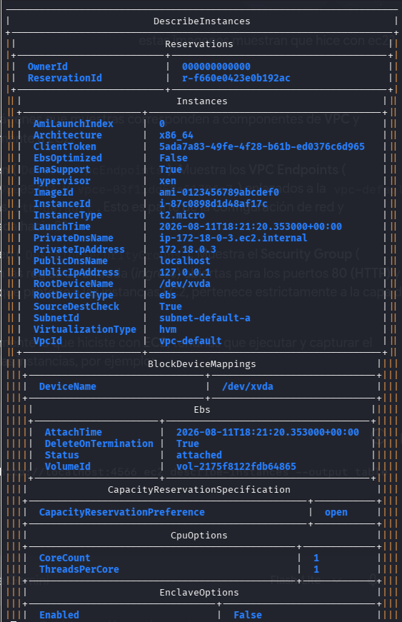
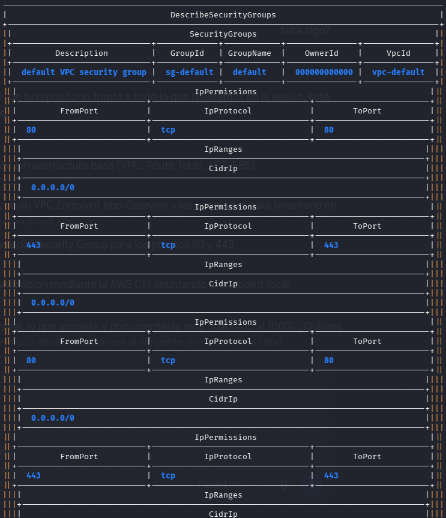

# 🪣 Floci: S3 + VPC + EC2 Infrastructure Deployment

> AWS Compute, Networking & Private Connectivity provisioning with LocalStack | Infrastructure as Code | AWS CLI

---

## 📚 Tabla de Contenidos

- [Descripción](#-descripción)
- [Arquitectura](#️-arquitectura)
- [Requisitos](#-requisitos)
- [Implementación](#-implementación)
- [Validación](#-validación)
- [Resumen](#-resumen)

---

## 🎯 Descripción

**Floci** — Portafolio de infraestructura cloud en AWS. Este proyecto demuestra:

✅ Provisión de una **instancia EC2** con su volumen EBS
✅ Provisión de **buckets S3** para almacenamiento de objetos
✅ Conectividad privada mediante **VPC Endpoint (Gateway)** hacia S3
✅ Asociación del endpoint a la **Route Table** de la VPC
✅ Configuración de **Security Groups** con reglas de ingreso HTTP/HTTPS
✅ Validación con **LocalStack** antes de desplegar en AWS real

### Caso de Uso

Desplegar una **instancia EC2** dentro de una **VPC**, con acceso a un bucket **S3** sin salir a Internet mediante un **VPC Endpoint tipo Gateway** asociado a la tabla de rutas, y un **Security Group** que habilita el tráfico web estándar.

**Tecnologías:** AWS, AWS CLI, LocalStack, Docker, Bash, Git

---

## 🏗️ Arquitectura

### Especificación

| Componente               | CIDR/ID                              | Descripción                                   | Estado    |
| ------------------------ | ------------------------------------- | ---------------------------------------------- | --------- |
| **VPC**                  | `vpc-default`                        | Red virtual principal                          | ✅ Active |
| **Route Table**          | `rtb-default`                        | Tabla de rutas asociada a la VPC               | ✅ Active |
| **Instancia EC2**        | `i-87c0898d1d48af17c` (t2.micro)     | Cómputo, subred `subnet-default-a`             | ✅ Active |
| **Volumen EBS**          | `vol-2175f8122fdb64865`              | Disco raíz montado en `/dev/xvda`              | ✅ Active |
| **Bucket S3**            | `Bucket-floci`                       | Almacenamiento de objetos                      | ✅ Active |
| **VPC Endpoint (Gateway)** | `vpce-9a388b45495005493`           | Conecta `vpc-default` con S3 vía `rtb-default` | ✅ Available |
| **Security Group**       | `sg-default`                         | Firewall (Puertos 80, 443)                     | ✅ Active |

---

## 📦 Requisitos

### Software Necesario

```
# AWS CLI v2+
aws --version

# Docker (para LocalStack)
docker --version

# Git
git --version
```

### Configuración Inicial

```
# 1. Configurar AWS CLI
aws configure --profile localstack
# AWS Access Key ID: test
# AWS Secret Access Key: test
# Default region: us-east-1

# 2. Iniciar LocalStack
docker run -d -p 4566:4566 \
  -e SERVICES=s3,ec2,vpc \
  localstack/localstack:latest

# 3. Verificar conexión
aws --endpoint-url=http://localhost:4566 s3 ls
```

---

## 🔧 Implementación


### 1. Crear Bucket S3

```
aws --endpoint-url=http://localhost:4566 s3 mb s3://Bucket-floci
```

**Resultado:** `Bucket-floci`

---

### 2. Crear VPC Endpoint (Gateway) hacia S3

```
aws --endpoint-url=http://localhost:4566 ec2 create-vpc-endpoint \
    --vpc-id vpc-default \
    --service-name com.amazonaws.us-east-1.s3 \
    --route-table-ids rtb-default \
    --vpc-endpoint-type Gateway
```

**Resultado:** `vpce-9a388b45495005493`

---

### 3. Security Group (Ingreso HTTP/HTTPS)

```
# Autorizar HTTP (80)
aws --endpoint-url=http://localhost:4566 ec2 authorize-security-group-ingress \
    --group-id sg-default \
    --protocol tcp \
    --port 80 \
    --cidr 0.0.0.0/0

# Autorizar HTTPS (443)
aws --endpoint-url=http://localhost:4566 ec2 authorize-security-group-ingress \
    --group-id sg-default \
    --protocol tcp \
    --port 443 \
    --cidr 0.0.0.0/0
```

---



## ✅ Validación

### Listar contenido del Bucket

```
aws --endpoint-url=http://localhost:4566 s3 ls
```

### Inspeccionar VPC Endpoints

```
aws --endpoint-url=http://localhost:4566 ec2 describe-vpc-endpoints --output table
```

### Inspeccionar Security Groups

```
aws --endpoint-url=http://localhost:4566 ec2 describe-security-groups --group-ids sg-default
```

---


## 📊 Resumen

| Métrica             | Valor            |
| -------------------- | ---------------- |
| Comandos AWS CLI     | 5                |
| Recursos creados     | 3                |
| VPC Endpoints        | 1 (Gateway → S3) |
| Puertos abiertos     | 2 (80, 443)      |
| Costo AWS            | $0 (LocalStack)  |


---

## 📚 Referencias

- [AWS S3 Documentation](https://docs.aws.amazon.com/s3/)
- [AWS VPC Endpoints](https://docs.aws.amazon.com/vpc/latest/privatelink/vpc-endpoints.html)
- [LocalStack Docs](https://docs.localstack.cloud/)

---

**Floci** — Cloud Infrastructure Portfolio | AWS | Networking | IaC

*Versión 1.0.0 | Agosto 2026 | MIT License*
