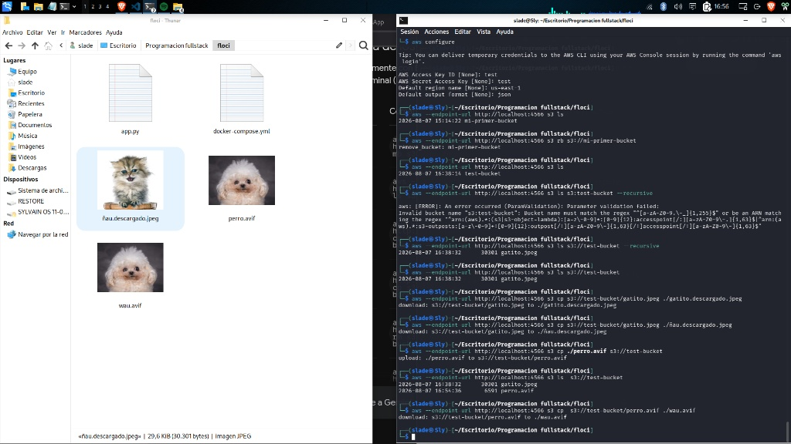
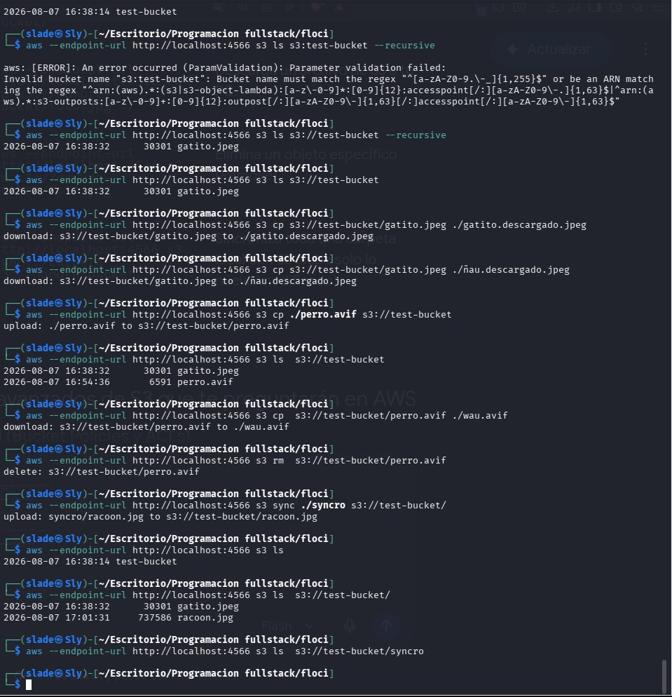

# WS S3 Local Environment with Floci CLI

Este repositorio contiene la guía práctica y documentación para simular y operar servicios de almacenamiento de objetos **Amazon S3** en un entorno local utilizando **LocalStack** y la interfaz visual **Floci**.

---

## 🛠️ Requisitos Previos

* **Docker / Docker Desktop** (en ejecución)
* **AWS CLI** instalado y configurado
* **Floci / LocalStack** en ejecución local

---

## 🚀 Guía de Uso Rápido

### 1. Iniciar la interfaz de Floci / LocalStack
Asegúrate de que el contenedor de Floci / LocalStack esté corriendo en tu puerto local (por defecto `http://localhost:4566` o `http://localhost:4500`).

### 2. Creación de un Bucket
Para crear un nuevo bucket S3 simulado de forma local:

```bash
aws --endpoint-url http://localhost:4566 s3 mb s3://test-bucket
```

### 3. Subida y Copia de Archivos (`cp`)
Para subir un archivo local al bucket S3:

```bash
aws --endpoint-url http://localhost:4566 s3 cp ./gatito.jpeg s3://test-bucket/
```

Descargar un archivo del bucket a tu máquina local:

```bash
aws --endpoint-url http://localhost:4566 s3 cp s3://test-bucket/gatito.jpeg ./gatito.descargado.jpeg
```

### 4. Listar Contenido del Bucket (`ls`)
Listar los objetos almacenados dentro del bucket:

```bash
aws --endpoint-url http://localhost:4566 s3 ls s3://test-bucket/
```

### 5. Sincronización de Archivos (`sync`)
Sincronizar una carpeta o archivo local hacia el bucket:

```bash
aws --endpoint-url http://localhost:4566 s3 sync ./syncro s3://test-bucket/
```

### 6. Eliminación de Objetos y Buckets (`rm` / `rb`)
Eliminar un objeto específico:

```bash
aws --endpoint-url http://localhost:4566 s3 rm s3://test-bucket/perro.avif
```

Eliminar un bucket y todo su contenido de forma forzada:

```bash
aws --endpoint-url http://localhost:4566 s3 rb s3://test-bucket --force
```

---

## 📸 Evidencia y Demostración Visual

Las capturas de pantalla de las pruebas ejecutadas en este taller se encuentran almacenadas dentro de la carpeta `images/`:

### 1. Interfaz de Floci y Objetos Almacenados
Demostración de la consola web de Floci visualizando los archivos subidos al bucket (`gatito.jpeg`):



---

### 2. Flujo Completo de Operaciones AWS CLI
Ejecución en consola de comandos mostrando:
* Creación, subida y descarga de archivos (`cp`).
* Sincronización automática (`sync`).
* Eliminación individual de objetos (`rm`).
* Eliminación completa y forzada del bucket (`rb --force`).



---

## 📌 Resumen de Comandos S3 Utilizados

| Comando | Descripción | Ejemplo de Uso |
| :--- | :--- | :--- |
| `mb` | Crear un nuevo bucket S3 | `aws --endpoint-url http://localhost:4566 s3 mb s3://nombre-bucket` |
| `ls` | Listar buckets o contenido de un bucket | `aws --endpoint-url http://localhost:4566 s3 ls s3://nombre-bucket` |
| `cp` | Copiar archivos (subir o descargar) | `aws --endpoint-url http://localhost:4566 s3 cp archivo.jpg s3://nombre-bucket/` |
| `sync` | Sincronizar directorio/archivo local con S3 | `aws --endpoint-url http://localhost:4566 s3 sync ./carpeta s3://nombre-bucket/` |
| `rm` | Eliminar un objeto en S3 | `aws --endpoint-url http://localhost:4566 s3 rm s3://nombre-bucket/archivo.jpg` |
| `rb` | Eliminar un bucket (usar `--force` para borrar con contenido) | `aws --endpoint-url http://localhost:4566 s3 rb s3://nombre-bucket --force` |
